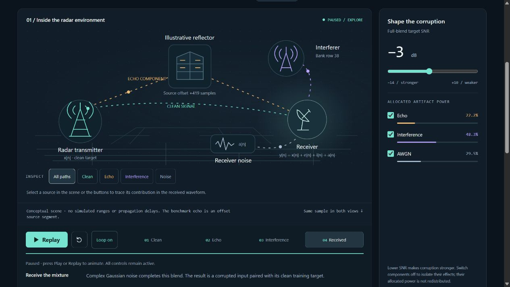
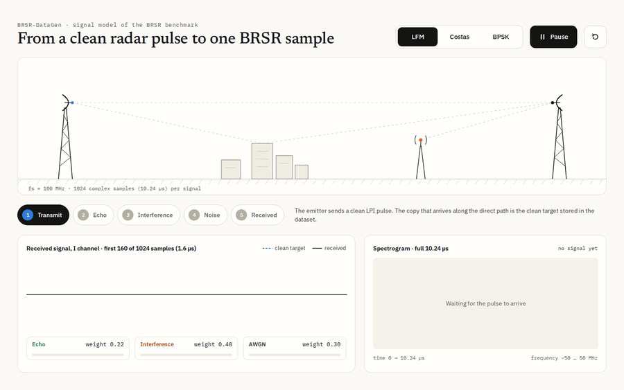
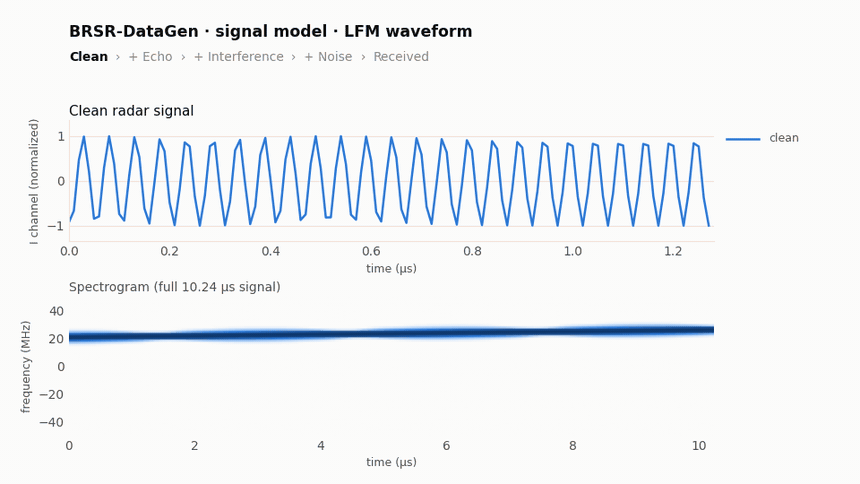
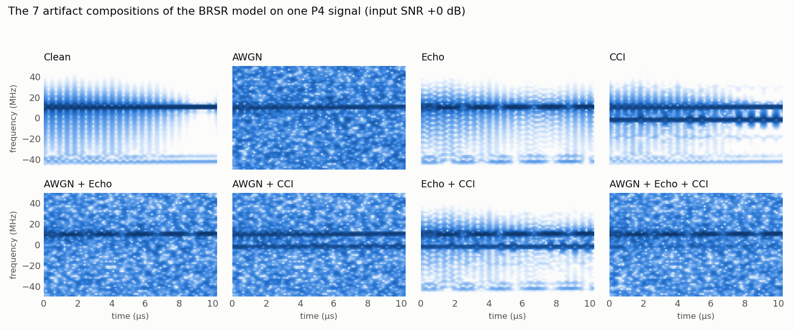
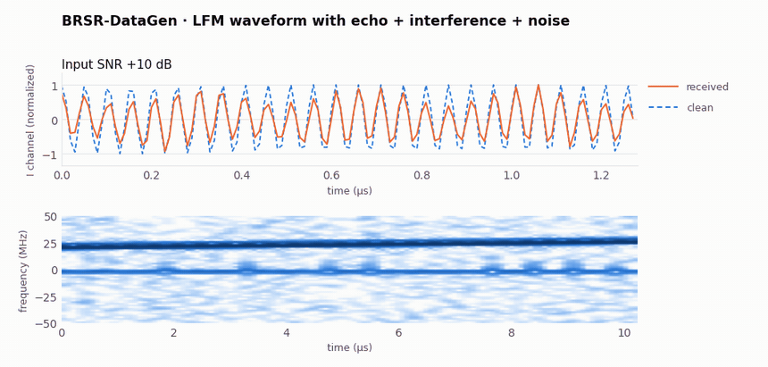
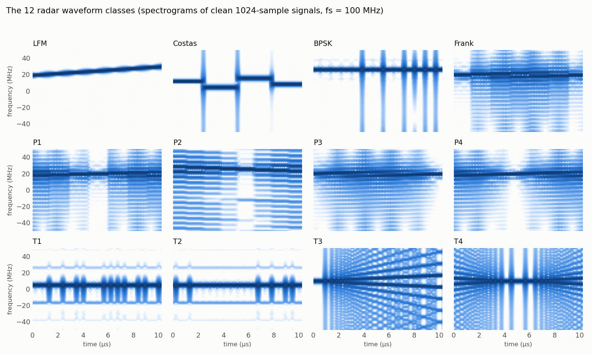

# BRSR-DataGen

**Paired radar signals for blind restoration: clean targets, corrupted inputs, and the components in between.**

[](https://github.com/MUzairZahid/BRSR-DataGen/actions/workflows/tests.yml)
[](https://doi.org/10.5281/zenodo.23010395)
[](https://doi.org/10.1016/j.neunet.2025.107709)
[](LICENSE)

Generate synthetic complex I/Q signals for the **Blind Radar Signal Restoration (BRSR)** benchmark: **12 LPI waveform classes** with random blends of **AWGN, benchmark echo and co-channel interference**. MATLAB and Python implementations follow the original BRSR generation conventions and write compatible HDF5 datasets for restoration, denoising and modulation-recognition research.

| Waveforms | Corruption model | Signal format | Implementations |
|---|---|---|---|
| LFM, Costas, Barker BPSK, Frank, P1–P4, T1–T4 | 7 artifact combinations; target SNR from −14 to +10 dB by default | 1,024 complex samples at 100 MHz; separate I/Q channels | Python 3.8+ (NumPy + h5py); MATLAB without additional toolboxes |

**[Explore a signal](https://muzairzahid.github.io/BRSR-DataGen/signal_observatory.html)** · **[Generate a small dataset](#quick-start)** · **[Read the output](#read-a-generated-sample)** · **[Download the published benchmark](https://doi.org/10.5281/zenodo.23010395)** · **[Cite this work](#citation)**

> **Generator or benchmark?** This repository generates new, seeded data using the BRSR code conventions. For reproducible comparisons with published results, use the released [BRSR benchmark on Zenodo](https://doi.org/10.5281/zenodo.23010395). The original generation was not seeded, so rerunning this generator does not recreate those exact files.

## Explore the Signal Observatory

<p align="center">
  <a href="https://muzairzahid.github.io/BRSR-DataGen/signal_observatory.html"></a>
</p>
<p align="center"><strong><a href="https://muzairzahid.github.io/BRSR-DataGen/signal_observatory.html">Open the interactive Signal Observatory →</a></strong></p>

Explore **all 12 waveform classes**, with **three seeded observations per class**. An animated radar scene and side-by-side **clean / received** waveforms and spectrograms show the same sample. Select a source to highlight its contribution in both views, adjust the target SNR, switch I/Q channels, or inspect the full observation. The view uses real generator output and reports the **measured SNR** of the current mixture. The scene is a conceptual illustration of the additive model; its paths do not determine physical delays or signal gains. Controls rescale fixed generator realizations, and **Next sample** cycles through the three stored observations.

The page works on desktop and mobile, supports keyboard controls and reduced motion, and runs as a self-contained HTML file. See [data provenance and build instructions](docs/SIGNAL_OBSERVATORY.md).

<details>
<summary><strong>Original radar-environment animation — still available</strong></summary>

<p align="center">
  <a href="https://muzairzahid.github.io/BRSR-DataGen/radar_environment.html"></a>
</p>

[Open the original interactive animation](https://muzairzahid.github.io/BRSR-DataGen/radar_environment.html). Its page and GIF are preserved. The landscape and arrival sequence are illustrative; the exact synthetic model and its source-offset convention are described below.

</details>

## Quick start

### Python

Install with Python 3.8+ and Git, then generate a small dataset first:

```bash
python -m pip install git+https://github.com/MUzairZahid/BRSR-DataGen.git
python -m brsr_datagen --mode brsr --out data_small --seed 0 --n_train 5 --n_test 2
```

This creates **624 training, 156 validation and 312 test samples**, plus a metadata CSV. In BRSR mode, target SNR is drawn continuously from [−14, +10] dB; the 13 SNR-loop iterations determine sample counts, not 13 discrete corruption levels.

```text
data_small/
├── brsr_train.h5
├── brsr_validation.h5
├── brsr_test.h5
└── brsr_metadata.csv
```

Use a new output directory for each run: existing files with the same names are overwritten.

<details>
<summary><strong>Full-size generation and AWGN-only baseline</strong></summary>

```bash
# Default BRSR-sized run: 49,920 train + 12,480 validation + 23,400 test
python -m brsr_datagen --mode brsr --out data_brsr --seed 0

# Small AWGN-only run at 13 discrete SNR levels: -14, -12, ..., +10 dB
python -m brsr_datagen --mode awgn --out data_awgn --seed 0 --n_train 5 --n_test 2

# Show available command-line options
python -m brsr_datagen --help
```

Omit `--n_train` and `--n_test` for the full-size AWGN run. These options count signals per class per SNR-loop iteration, before the train/validation split.

</details>

### MATLAB

Clone or download this repository and run from its root:

```matlab
addpath('matlab');
cfg = brsr_config('mode', 'brsr', 'seed', 0, 'n_train', 5, 'n_test', 2);
generate_brsr_dataset(cfg, 'data_small_matlab');
```

See [MATLAB examples](matlab/examples/) for generation and component plots. The implementations share the signal model and file layout; the same seed does **not** imply identical samples across MATLAB and Python because their random-number streams differ.

### Read a generated sample

```python
import h5py
import numpy as np

with h5py.File('data_small/brsr_test.h5', 'r') as f:
    clean = f['clean'][0]                 # [2, 1024]: I, Q
    noisy = f['noisy'][0]                 # corrupted model input
    artifacts = f['distortions'][0]       # [3, 2, 1024]: AWGN, Echo, CCI
    label = int(f['label'][0])            # 1-based class label

np.testing.assert_allclose(noisy, clean + artifacts.sum(axis=0), atol=1e-4)
z = noisy[0] + 1j * noisy[1]              # complex received signal
```

Values retain generator amplitudes; the HDF5 signals are not normalized for a particular model. See the [BRSR-OpGAN evaluation protocol](https://github.com/MUzairZahid/BRSR-OpGAN/blob/main/docs/EVALUATION_PROTOCOL.md) for its preprocessing and reference-dependent output scaling.

<details>
<summary><strong>Generate one clean/corrupted pair in Python</strong></summary>

```python
import numpy as np
from brsr_datagen import Config, make_waveform, sample_parameters, add_artifacts, load_interference_bank

cfg, rng = Config(), np.random.default_rng(0)
params = sample_parameters('Frank', 1, rng, cfg)[0]
wave = make_waveform('Frank', params, 2048, rng, cfg)
clean, noisy, components, info = add_artifacts(
    wave, snr_db=-5, bank=load_interference_bank(), rng=rng
)
print(info)  # composition, power fractions, source offset and interference-bank row
```

</details>

## Signal model

The implementation adds independently scaled artifact components to a clean segment:

```text
noisy = clean + AWGN + echo + CCI
```

1. Draw a **target SNR** uniformly in [−14, +10] dB and calculate the artifact-power budget: `P = P_clean / 10^(SNR_target/10)`.
2. Choose one of **seven nonempty compositions** uniformly: the three single artifacts, three pairs, or all three.
3. Draw nonnegative **power fractions** that sum to one. Each selected raw artifact `a_i` is scaled by `sqrt(w_i * P / mean(abs(a_i)^2))`.
4. Add the scaled components and store them alongside the clean/corrupted pair.

| Component | What the implementation uses |
|---|---|
| AWGN | Complex Gaussian samples, scaled to their allocated power |
| Benchmark echo | A segment of the same longer source waveform, with a positive source offset of 128–512 samples |
| Co-channel interference | One row of a fixed bank containing 50 complex signals, 35 distinct |

**Echo convention.** The clean slice starts at `start`; the echo source starts at `start + offset`. This preserves the original code's convention. It is not a causal `x(t − τ)` propagation model. There is no simulated scene geometry, path loss, Doppler or antenna pattern.

**Target versus measured SNR.** Component power budgets add to `P`, but the power of their sum includes cross-terms. Consequently, a mixed sample's measured SNR can differ from its target. Both are recorded in the CSV; the HDF5 `snr_db` field stores the target.

<details>
<summary><strong>Visual examples: buildup, compositions and SNR sweep</strong></summary>

<p align="center"></p>
<p align="center"><em>Component buildup is an explanatory sequence; the enabled components coexist in the final observation.</em></p>

<p align="center"></p>

<p align="center"></p>

</details>

## Waveform classes

<p align="center"></p>

Complex I/Q signals use `fs = 100 MHz`. The table lists **generator input parameters**; cropping and resampling affect the observed segment and its frequencies.

| Class | Waveform family | Generator parameters |
|---|---|---|
| LFM | Linear frequency modulation | fc ∈ [fs/6, fs/5], sweep parameter ∈ [fs/20, fs/16], up or down |
| Costas | Frequency hopping | fmin ∈ [fs/30, fs/24], random permutation of length 3–5 |
| BPSK | Barker binary phase code | fc ∈ [fs/13, fs/10], code length 7, 11 or 13, 20 cycles per chip |
| Frank, P1 | Polyphase codes | fc ∈ [fs/6, fs/5], M ∈ {6, 7, 8}, 3–5 cycles per chip |
| P2 | Polyphase code | fc ∈ [fs/6, fs/5], M ∈ {6, 8}, 3–5 cycles per chip |
| P3, P4 | Polyphase codes | fc ∈ [fs/6, fs/5], 36, 49 or 64 subcodes, 3–5 cycles per chip |
| T1, T2 | Polytime codes | fc ∈ [fs/6, fs/5], 4–6 segments, 2 phase states |
| T3, T4 | Polytime codes | fc ∈ [fs/13, fs/10], bandwidth parameter ∈ [fs/20, fs/10], 2 phase states |

The legacy **Costas-labelled class samples arbitrary permutations** without enforcing the Costas distinct-displacement property. The Signal Observatory uses a validated sequence; the dataset generator keeps the original sampling behaviour.

## Output format

| File | Contents |
|---|---|
| `brsr_train.h5`, `brsr_validation.h5`, `brsr_test.h5` | One file per split |
| `brsr_metadata.csv` | Per-sample provenance and corruption parameters |

AWGN mode uses the `awgn_baseline_` prefix instead. Defaults produce 49,920 training, 12,480 validation and 23,400 test samples; validation is selected from the 62,400-sample training run, stratified by class.

| HDF5 key | Shape / meaning |
|---|---|
| `clean`, `noisy` | `[N, 2, 1024]`, float32 by default; channel 0 = I, channel 1 = Q |
| `distortions` | `[N, 3, 2, 1024]`; component order = AWGN, Echo, CCI; BRSR mode only |
| `label` | `[N]`, labels 1–12 in the waveform-class order shown above |
| `snr_db` | `[N]`, target SNR in dB |
| `gen_index` | `[N]`, generation index within the train or test run |

File attributes include class names, split, signal layout, generator version and configuration. MATLAB's `h5read` returns dimensions in reverse order.

The CSV identifies each signal by `split` and zero-based `row`. It records `class_name`, `snr_target_db`, `snr_measured_db`, waveform parameters (`params`), and, in BRSR mode, `composition`, `w_awgn`, `w_echo`, `w_cci`, `echo_delay`, `cci_bank_row` and `segment_start`. The legacy field name `echo_delay` denotes the source offset described above.

## Configuration

| Python `Config` / MATLAB `brsr_config` | Default | Meaning |
|---|---|---|
| `mode` | `brsr` | Random artifact blends; `awgn` uses AWGN at discrete SNRs |
| `seed` | 0 | Seed for reproducibility within an implementation and environment |
| `n_train`, `n_test` | 400, 150 | Samples per class per SNR-loop iteration, before validation splitting |
| `snr_min`, `snr_max` | −14, 10 | Continuous target SNR bounds in BRSR mode |
| `snr_levels` | −14:2:10 | Discrete AWGN levels; loop count also determines BRSR run size |
| `param_sampling` | `grid` | Shuffled parameter grids; `uniform` draws independent parameters |
| `legacy_lfm` | true | Preserve original LFM amplitude convention |
| `echo_delay` | [128, 512] | Benchmark echo source-offset range, in samples |

Python `Config.compositions` can restrict the permitted artifact combinations; the MATLAB config does not expose that option. Use `python -m brsr_datagen --help` for CLI options; not every configuration field has a CLI flag.

## Benchmark conventions and reproducibility

The defaults preserve choices in the original code rather than silently changing the benchmark model:

- **Resampling:** variable-length waveforms are linearly resampled to the target length, which changes their effective frequencies at fixed `fs`.
- **LFM amplitude:** the original expression adds random φ₀ outside the imaginary unit, `A·exp(j2πft + φ₀)`, scaling amplitude by `exp(φ₀)`. Use `--fixed_lfm` / `legacy_lfm=false` for the corrected phase convention; this changes the published-data convention.
- **Parameter grids:** grids are reshuffled for each SNR-loop iteration. In AWGN mode this repeats clean waveforms across levels. Use `param_sampling='uniform'` for independent parameter draws.
- **Echo, Costas and interference bank:** the source-offset direction, unvalidated permutation sampling and 50-row bank follow the implementation, as detailed above.
- **Paper/code differences:** the paper describes a causal delayed echo and a 100-signal interference set. Its Eq. 22 places the blend weight outside the square root; the implementation allocates power using `sqrt(w_i * P / P_i)`. This repository retains the code conventions and makes them explicit.

For a reproducible experiment, retain the generator revision, configuration, seed and output metadata. Use the released benchmark for claims about published test-set performance.

## Validation and development

From a local checkout:

```bash
python -m pip install -e ".[test]"
python -m pytest -q
```

- [Waveform reference tests](tests/test_waveforms_match_matlab.py) compare Python waveforms and resampling against stored MATLAB/Octave reference arrays, using `rtol=1e-9` and amplitude-scaled absolute tolerance.
- [Generator tests](tests/test_generator.py) check split sizes, class balance, additive reconstruction, power allocations, metadata and seed reproducibility.
- [Published-data comparison](scripts/compare_with_published.py) compares per-class clean-signal power, spectral centroid and bandwidth with a supplied published test file. This is a statistical diagnostic, not proof of sample-for-sample equivalence.

To rebuild the separate Signal Observatory:

```bash
python scripts/make_signal_observatory.py
```

See [the observatory guide](docs/SIGNAL_OBSERVATORY.md) for its numerical and display conventions. The original animation has its own builder and recorder.

<details>
<summary><strong>Repository map</strong></summary>

```text
BRSR-DataGen/
├── python/brsr_datagen/           # waveforms, artifacts, generation and CLI
├── matlab/                       # MATLAB implementation and examples
├── tests/                        # generator tests and MATLAB reference arrays
├── scripts/
│   ├── make_figures.py           # existing README figures
│   ├── make_environment_page.py  # original animation builder
│   ├── record_environment_gif.py # original GIF recorder
│   ├── make_signal_observatory.py
│   └── signal_observatory_template.html
├── legacy/                       # original BRSR v1.0 generation scripts
└── docs/
    ├── radar_environment.html    # original page, preserved
    ├── signal_observatory.html   # separate interactive redesign
    ├── SIGNAL_OBSERVATORY.md     # provenance and build instructions
    └── figures/
```

</details>

## Related

- **BRSR dataset** (the published benchmark): [Zenodo, DOI 10.5281/zenodo.23010395](https://doi.org/10.5281/zenodo.23010395)
- **BRSR-OpGAN** code and pre-trained models: [github.com/MUzairZahid/BRSR-OpGAN](https://github.com/MUzairZahid/BRSR-OpGAN)
- **CoRe-Net**: Co-Operational Regressor Network with Progressive Transfer Learning for Blind Radar Signal Restoration, *Machine Learning with Applications* 25, 100939 (2026). [doi:10.1016/j.mlwa.2026.100939](https://doi.org/10.1016/j.mlwa.2026.100939)

## Citation

If you use this generator or data made with it, please cite:

```bibtex
@article{zahid2025brsropgan,
  title   = {{BRSR-OpGAN}: Blind radar signal restoration using operational generative adversarial network},
  author  = {Zahid, Muhammad Uzair and Kiranyaz, Serkan and Yildirim, Alper and Gabbouj, Moncef},
  journal = {Neural Networks},
  volume  = {190},
  pages   = {107709},
  year    = {2025},
  doi     = {10.1016/j.neunet.2025.107709}
}

@dataset{zahid2026brsr_dataset,
  title     = {{BRSR} Dataset: Blind Radar Signal Restoration Benchmark (v1.0)},
  author    = {Zahid, Muhammad Uzair and Kiranyaz, Serkan and Yildirim, Alper and Gabbouj, Moncef},
  publisher = {Zenodo},
  version   = {1.0},
  year      = {2026},
  doi       = {10.5281/zenodo.23010395}
}
```

## License

MIT (see [LICENSE](LICENSE)).
